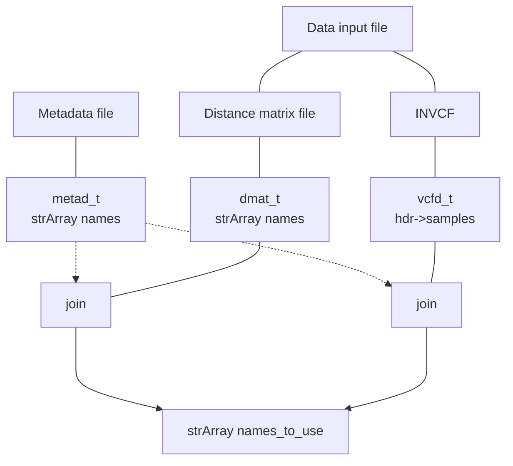

# doc/internal.MD

This document contains internal documentation for the ngsAMOVA package.

## Individual names

If distance matrix input, reorder names in dmat_t based on metad_t names.

<!-- If VCF input, set pars->names using hdr->samples, reorder metadata names based on pars->names (??) -->

