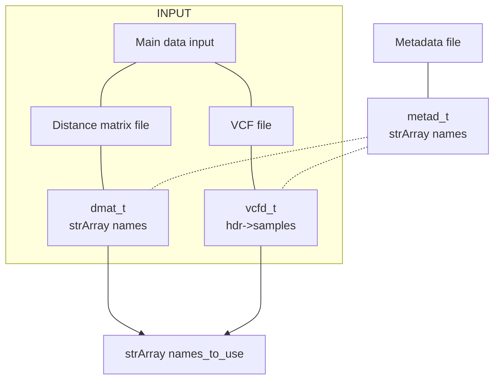
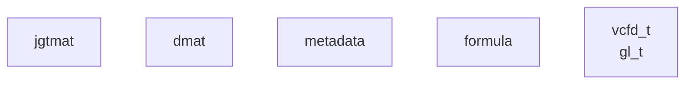

# doc/internal.MD

This document contains internal documentation for the ngsAMOVA package.

## Individual names

If distance matrix input, reorder names in dmat_t based on metad_t names.

<!-- If VCF input, set pars->names using hdr->samples, reorder metadata names based on pars->names (??) -->



```
        pars->names = ptrto metadata->names


if input is distance matrix
    if metadata input is provided
        filter and reorder dmat_t based on metad_t names
        dmat->names = ptrto metadata->names
        pars->names = ptrto metadata->names
    else
        dmat->names = allocated and filled from dmat input
        pars->names = ptrto dmat->names

else if input is VCF

    if metadata input is provided
        exclude samples from VCF that are not in metadata (set bool vcfd->includeSamples[bcf_hdr_nsamples(vcfd->hdr)]), no need to reorder
        pars->names = ptrto metadata->names
    else
        pars->names = allocated and filled from vcfd->hdr->samples

    if doDist
        dmat->names = allocated and filled from pars->names

```

<!-- -doJGTM <int>  : get joint genotypes matrix for each individual pair
                ret: jgtmat
-doDist <int>  : estimate pairwise distance matrix
                req: jgtmat
                ret: dmat

-doAMOVA <int> : perform AMOVA analysis
                req: dmat, metadata, formula

-doEM <int>    : perform EM optimization
                req: DATASOURCE_GL, lngl_t
                ret: jgtmat

TODO add doEM 2 for 10gls optim
-doDxy <int>   : estimate Dxy
                req: dmat
-doPhylo <int> : do neighbor-joining

-doIbd <int> 	: detect IBD segments

-doMajorMinor <int> : get major and minor alleles for each site -->


