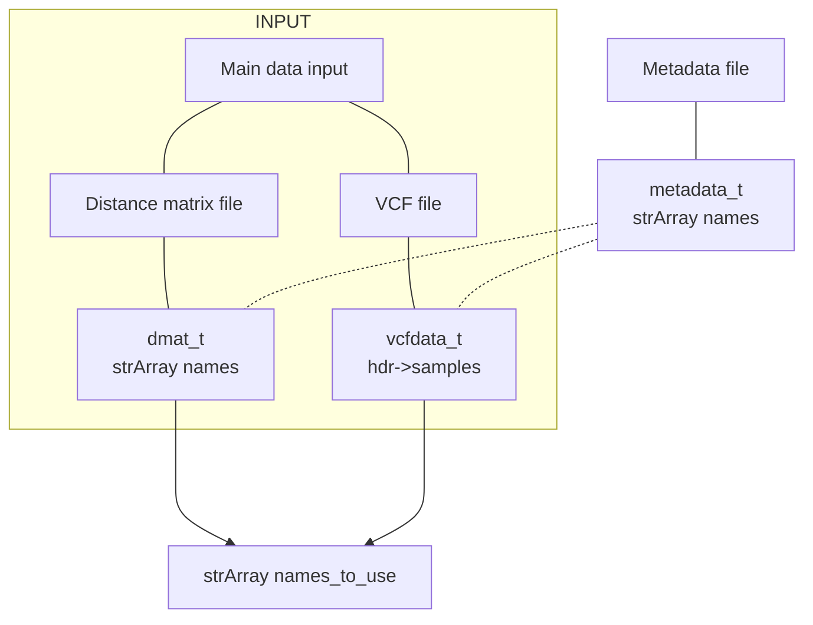
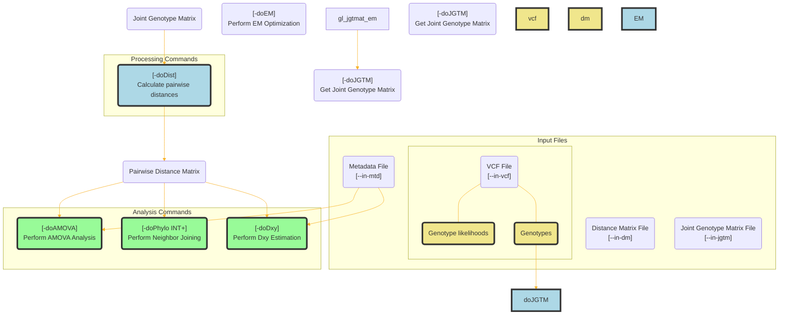
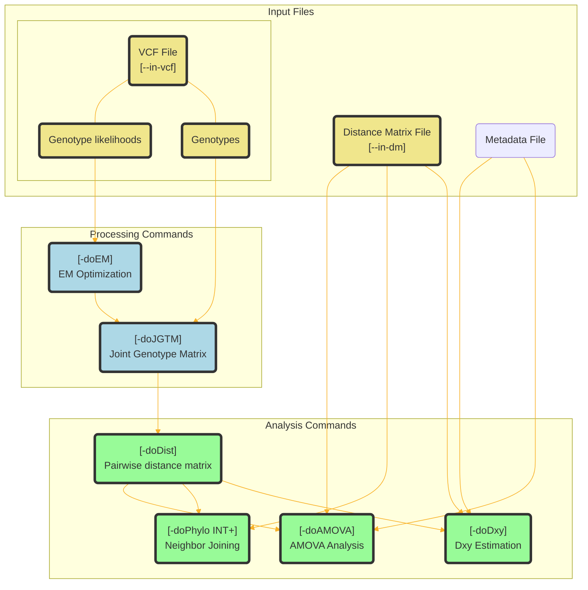
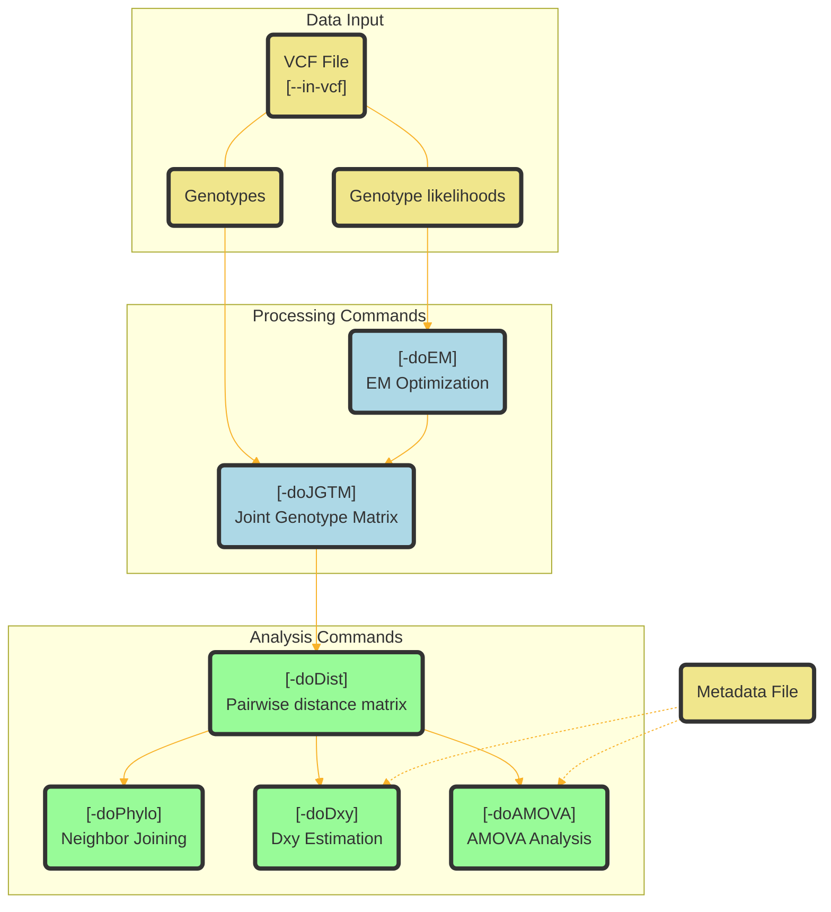
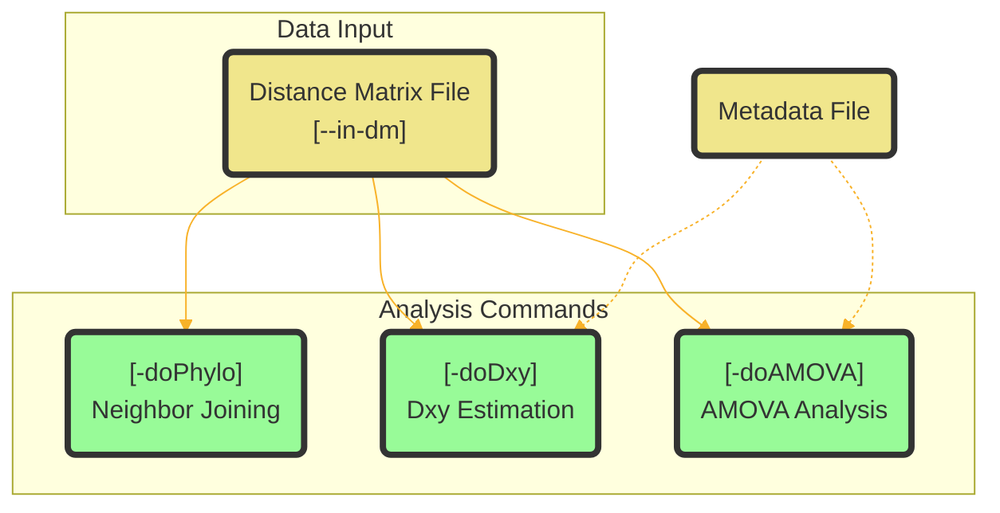

# doc/internal.MD

This document contains internal documentation for the ngsAMOVA package.

## Individual names

If distance matrix input, reorder names in dmat_t based on metadata_t names.

<!-- If VCF input, set pars->names using hdr->samples, reorder metadata names based on pars->names (??) -->



```
if input is distance matrix
    if metadata input is provided
        filter and reorder dmat_t based on metadata_t names
        dmat->names = ptrto metadata->names
        pars->names = ptrto metadata->names
    else
        dmat->names = allocated and filled from dmat input
        pars->names = ptrto dmat->names

else if input is VCF

    if metadata input is provided
        exclude samples from VCF that are not in metadata (set bool vcfd->includeSamples[bcf_hdr_nsamples(vcfd->hdr)]), no need to reorder
        pars->names = ptrto metadata->names
    else
        pars->names = allocated and filled from vcfd->hdr->samples

    if doDist
        dmat->names = allocated and filled from pars->names

```





Diagram of available analysis commands and their dependencies:





## VCF input



## Distance matrix input




## lifetime

vcfd: until we have jgtmat
jgtmat: until we have dmat
dmat: until the end of all analyses


## Analysis commands

<!-- 

--in-vcf <STR> : input VCF file
                returns: vcfdata, gldata

--in-dm <STR>  : input distance matrix file
                returns: dmat

-doJGTM <INT>  : get pairwise joint genotype matrix
                returns: jgtmat

-doDist <INT>  : estimate pairwise distance matrix
                requires: jgtmat
                returns: dmat

-doAMOVA <INT> : perform AMOVA analysis
                requires: dmat, metadata, formula

-doEM <INT>    : perform EM optimization
                requires: gldata
                returns: jgtmat

-doDxy <INT>   : estimate Dxy
                requires: dmat

-doPhylo <INT> : do neighbor-joining tree
                requires: dmat

-doMajorMinor <INT> : get major and minor alleles for each site 
                requires: vcfdata, alleles input file (optional)
                returns: alleles
-->


